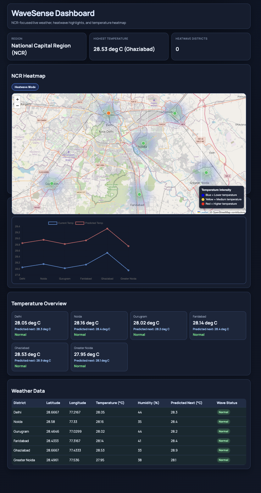

# 🌊 WaveSense – NCR Smart Weather Intelligence Dashboard

🚀 A real-time + predictive weather dashboard that visualizes heatwave risks across NCR using live and forecast data.

---

## 🔥 Live Features

- 🌡 Real-time weather data (OpenWeather API)
- 🔮 Forecast-based heatwave prediction system
- 🗺 Interactive NCR map (Leaflet.js)
- 🔥 Temperature heatmap visualization
- 🎯 Animated pulse markers for high-risk zones
- 📊 Smart dashboard (stats + charts)
- ⚠ Alert system for upcoming heatwaves
- 🔄 Auto-refresh for real-time feel

---

## 🧠 How It Works

- Fetches current + forecast weather data
- Analyzes next 5 time intervals (3-hour gaps)
- Calculates average temperature
- Predicts risk levels:

| Condition | Prediction |
|----------|-----------|
| > 38°C | 🔴 Heatwave Likely |
| 30-38°C | 🟠 Warning |
| < 30°C | 🟢 Normal |

---

## 🗺 Visualization Intelligence

- Heatmap shows temperature intensity across regions
- Animated markers highlight critical zones
- Users can instantly identify high-risk areas without reading data

---

## 🛠 Tech Stack

### Frontend

- HTML
- CSS
- JavaScript
- Leaflet.js + Leaflet.heat

### Backend

- Python (Flask)
- OpenWeather API

---

## 📸 Project Preview

---

## 🚀 Future Improvements

- AI-based risk scoring (0-100)
- Historical trend comparison
- Smart browser notifications
- Mobile responsive UI

---

## 💼 Why This Project?

This project demonstrates:

- API integration
- Data analysis + prediction logic
- Real-time systems design
- Data visualization
- UI/UX thinking

---

## 👩‍💻 Author

**Pallavi Singh**
